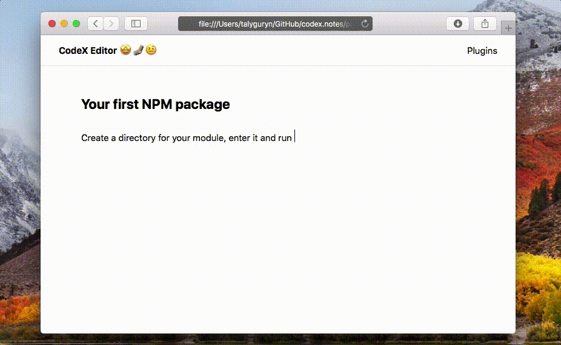

# InlineCode Tool

Inline Tool for marking code-fragments for the [Editor.js](https://ifmo.su/editor).



## Installation

Get the package

```shell
yarn add @editorjs/inline-code
```

Include module at your application

```javascript
import InlineCode from '@editorjs/inline-code';
```

Optionally, you can load this tool from CDN [JsDelivr CDN](https://cdn.jsdelivr.net/npm/@editorjs/inline-code@latest)

## Usage

Add a new Tool to the `tools` property of the Editor.js initial config.

```javascript
var editor = EditorJS({
  ...
  
  tools: {
    ...
    inlineCode: {
      class: InlineCode,
      shortcut: 'CMD+SHIFT+M',
    },
  },
  
  ...
});
```

## Config Params

This Tool has no config params

## Output data

Marked text will be wrapped with a `span` tag with an `inline-code` class.

```json
{
    "type" : "text",
    "data" : {
        "text" : "Create a directory for your module, enter it and run <span class=\"inline-code\">npm init</span> command."
    }
}
```

